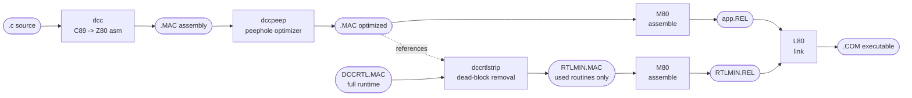
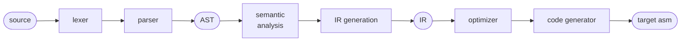
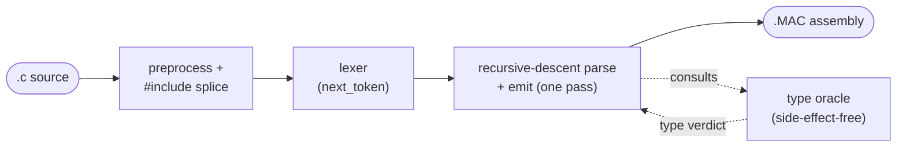
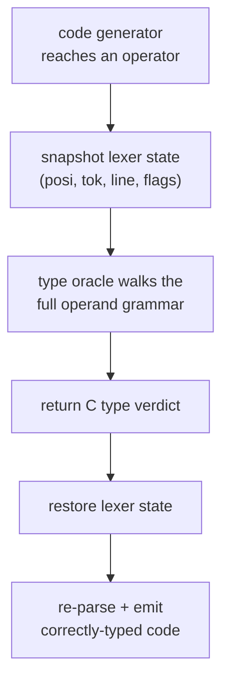
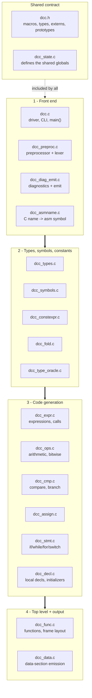
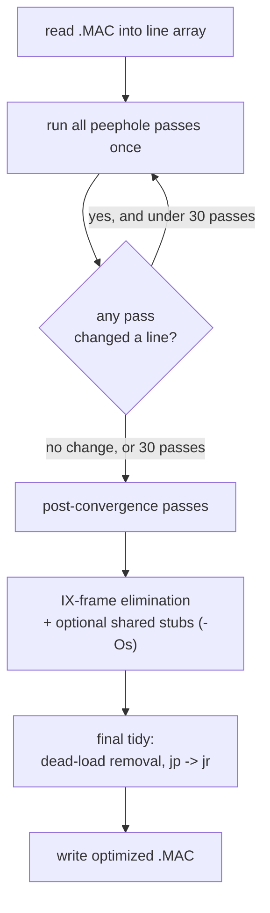
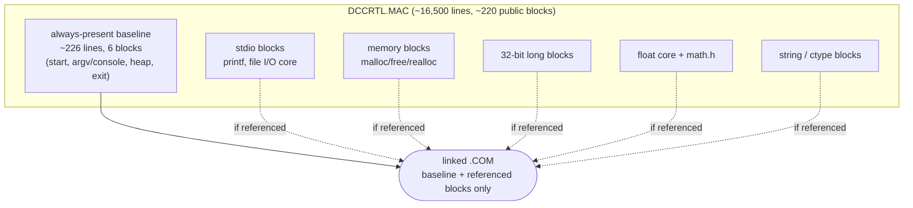

# Appendix: compiler architecture

This appendix describes how the dcc toolchain is built internally and relates
its design to the classical compiler architecture taught in textbooks. It
covers all three host tools — the compiler `dcc`, the peephole optimizer
`dccpeep`, and the runtime size reducer `dccrtlstrip` — and the off-the-shelf
Microsoft `M80` / `L80` assembler and linker that finish the job.

!!! note "These are *cross* tools"
    `dcc`, `dccpeep`, and `dccrtlstrip` are host programs: they are compiled
    with a modern C compiler and run on your desktop (Windows, macOS, Linux).
    They never run on a Z80. What they *emit* is Z80 assembly text and CP/M
    `.COM` files that run under CP/M-80 (for example via the `ntvcm` emulator).

## The toolchain at a glance

A single `.c` file becomes a CP/M `.COM` executable through a short pipeline.
Each stage has one job and hands a text or object file to the next:

| Stage | Tool | Input | Output | Role |
| --- | --- | --- | --- | --- |
| Compile | `dcc` | `.c` | `.MAC` | Translate C89 to Z80/M80 assembly |
| Optimize | `dccpeep` | `.MAC` | `.MAC` | Local peephole rewriting of the asm |
| Reduce runtime | `dccrtlstrip` | `DCCRTL.MAC` + app `.MAC` | `RTLMIN.MAC` | Keep only the runtime routines the app references |
| Assemble | `M80` | `.MAC` | `.REL` | Object code (relocatable) |
| Link | `L80` | `.REL` files | `.COM` | Resolve symbols into a CP/M executable |

The `dccpeep` stage is optional (`./ma.sh name nopeep` skips it). `dccrtlstrip`
runs against the *final* application assembly so it sees the real set of
runtime symbols the program calls.

## Where dcc sits in classic compiler theory

A textbook compiler is a pipeline of well-separated phases, each consuming the
data structure produced by the previous one — typically an abstract syntax tree
(AST) and one or more intermediate representations (IR):

dcc deliberately **collapses the middle of that pipeline**. It is a
**single-pass, syntax-directed translator**: there is no AST and no IR. As the
parser recognises a grammar construct it immediately emits the corresponding
Z80 assembly. This is the same lineage as the earliest C compilers and is the
classic technique described as *syntax-directed translation* — semantic actions
attached directly to grammar rules.

The trade-off table below maps dcc onto the textbook phases:

| Classic phase | Conventional design | dcc's approach |
| --- | --- | --- |
| Lexical analysis | Separate tokenizer | `next_token` lexer in `dcc_preproc.c` (integrated with the preprocessor) |
| Parsing | Build an AST | Recursive-descent parse with **no AST**; actions emit code inline |
| Semantic analysis | Walk the AST, annotate types | Done *during* the parse against live symbol/type tables |
| Intermediate representation | One or more IRs (e.g. three-address code, SSA) | **None** — C maps straight to Z80 |
| Machine-independent optimization | Passes over the IR | Mostly absent by design; some peephole/idiom fast paths in codegen |
| Code generation | Lower IR to target | Emitted directly by the parser's semantic actions |
| Machine-dependent optimization | Target peephole pass | Separate program `dccpeep` over the emitted text |

### The cost of having no AST: type prediction

The one place where "no AST" genuinely hurts is *type prediction*. When the
parser reaches a binary operator, a `?:` arm, or a branch condition, it must
already have chosen 16-bit, 32-bit, or float code for the operand it is about
to generate — but with no tree there is nothing to consult.

dcc handles this in two layers:

- A **shallow source-text peek** (`peek_simple_unary_type`,
  `snippet_simple_type`) inspects just the first token or two of the upcoming
  operand. It is cheap but blind to types hidden behind parentheses, casts,
  struct members, or array decay.
- A **type oracle** (`dcc_type_oracle.c`) provides the complete answer.
  `typeof_conditional_arm()` walks the full expression grammar through its
  `to_*` ladder and reports the C type the generator will ultimately produce —
  applying the usual arithmetic conversions — but **emits no code**.

Because the oracle snapshots and restores **all** lexer/token state, a bug in
it can only produce a wrong *type verdict* — it can never desync the parser.
This is a **"1.5-pass" technique**: it buys accurate whole-expression type
information without the cost of a full AST or a second code-generating pass,
keeping dcc's single-pass character intact.

## Inside dcc: module architecture

The compiler is one binary built from focused modules that all share a single
umbrella header, `dcc.h`. Because parsing and code generation are interleaved
and share a large amount of file-scope state (the source buffer, the lookahead
token, the symbol/type tables, per-function codegen flags), the natural layout
is the classic single-binary compiler shape: **one shared header, many
cooperating `.c` files**, with all mutable state defined once in
`dcc_state.c`.

The thick arrows are the dominant translation pipeline (front end → types →
code generation → output). Within a stage the files are peers, and because
every module sees the same prototypes through `dcc.h`, any module may call any
other — the arrows show the usual direction, not a hard layering rule.

| Group | Modules | Responsibility |
| --- | --- | --- |
| Shared | `dcc.h`, `dcc_state.c` | Contract + single definition of all shared state |
| Front end | `dcc.c`, `dcc_preproc.c`, `dcc_diag_emit.c`, `dcc_asmname.c` | Driver/CLI, preprocessor + lexer, diagnostics + emit primitives, C-name-to-asm-symbol mapping |
| Types / symbols | `dcc_types.c`, `dcc_symbols.c`, `dcc_constexpr.c`, `dcc_fold.c`, `dcc_type_oracle.c` | Type system, symbol tables, constant-expression evaluation, constant folding, the type oracle |
| Code generation | `dcc_expr.c`, `dcc_ops.c`, `dcc_cmp.c`, `dcc_assign.c`, `dcc_stmt.c`, `dcc_decl.c`, `dcc_stmt_fast.c` | Expression, operator, comparison, assignment, statement, and declaration lowering |
| Top level / output | `dcc_func.c`, `dcc_data.c` | Function/frame parsing and data-section emission |

## Inside dccpeep: a fixpoint peephole optimizer

`dccpeep` is dcc's **machine-dependent optimizer**. It reads the emitted `.MAC`
as an array of text lines and applies dozens of small *peephole* rewrites —
each one matches a short local instruction pattern and replaces it with a
cheaper equivalent (for example folding a redundant store/reload, threading a
jump-to-jump, turning an `ld`/`cp` against zero into `or a`, or replacing an
absolute `jp` in range with a relative `jr`).

Peephole optimization is itself a textbook technique; what makes dccpeep
notable is that it runs its whole catalogue to a **fixpoint** so that one
rewrite can expose the pattern another rewrite needs:

Key design points:

- **Driven to convergence.** The main loop re-runs every pass until a full
  sweep makes no change (capped at 30 iterations), because passes feed each
  other — e.g. a store/reload elimination can create a dead label that a later
  pass then removes.
- **Order-sensitive post-passes.** A few transforms must run *after*
  convergence: the signed-compare constant-bias fold, IX-frame elimination,
  and the shared-stub passes all depend on the instruction stream having
  settled, because earlier structural passes recognise loops by their
  canonical (un-folded) shape.
- **Two optimization goals.** `-Ot` (default, "time") inlines helper sequences
  for speed; `-Os` ("size") factors recurring sequences into shared `call`
  stubs to shrink the binary. The mode is chosen on the command line and
  changes which post-convergence passes fire.

!!! tip "Why a separate program instead of an in-compiler pass"
    Keeping the peephole optimizer as a standalone text-to-text filter keeps
    the compiler itself simple and lets you inspect, diff, and skip
    optimization (`nopeep`) trivially — the assembly is the contract between
    the two tools.

## The runtime: a block-structured library sized for stripping

The runtime `DCCRTL.MAC` is a single ~16,500-line assembly source, but its
*architecture* is what makes the toolchain's "pay only for what you use"
property possible. Rather than one monolithic blob, the runtime is written as
**~220 independent blocks**, each delimited by a `public` label and each
depending only on a small shared prelude. A program never links the whole
library — `dccrtlstrip` keeps only the blocks the application actually
references (the mark-and-sweep details are in the companion appendix
[*Runtime optimization*](01-dccrtlstrip.md)). The architectural
consequence is that **every routine has a well-defined, measurable size cost**.

### Two numbers describe every routine

Because the runtime is block-structured, each public routine has two costs that
the build-time size hook (`docs/docs/hooks/runtime_sizes.py`) measures directly:

- **self** — the source lines in the routine's own block.
- **marginal** — self *plus* every additional block it transitively pulls in
  beyond the always-present baseline. This is the real incremental cost of
  using a routine in a program that otherwise wouldn't need it.

The gap between the two is the whole story of the runtime's size architecture: a
small `self` with a large `marginal` means the routine sits on top of a big
shared substrate (the file-I/O core, or the float arithmetic core).

### The always-present baseline (~226 lines)

Six blocks are always linked because they are reachable from the forced `start`
root: program entry and heap/BSS setup, the command-tail `argv` builder (which
also contains the console writer `__conout`), the heap-state words, and
`exit`. Console output therefore costs essentially nothing extra — `putchar`
and `puts` call into code that is already present.

### What the feature groups cost

The runtime's size is dominated by a few shared cores. Routines that sit on a
core are cheap individually but expensive to introduce, because the first one
drags the whole core in:

| Feature group | Shared core it links | Marginal cost (lines) |
| --- | --- | ---: |
| Console output (`putchar`, `puts`, integer `printf`) | none (baseline only) | ~12–840 |
| File-stream + low-level I/O (`fopen`, `fread`, `fputs`, `fprintf`) | FCB/DMA file core (~470) | ~470–1,500 |
| `scanf` / `sscanf` / `fscanf` | shared 697-line scan core | ~1,290–1,305 |
| Memory (`malloc`/`free`/`realloc`/`calloc`) | heap helpers (`__mlh`, `__frcoal`) | ~130–650 |
| 32-bit `long` arithmetic | long mul/div/mod helpers | ~30–340 |
| `float` operators | normalise/round core (~700) | ~700–1,050 |
| `math.h` (`sinf`, `expf`, `powf`, …) | float core + conversions | ~1,500–3,300 |
| `string.h` / `ctype.h` | none (self-contained) | ~15–100 |

The exact per-routine `self`/`marginal` numbers — and the transitive
dependencies behind each one — are tabulated on the auto-generated
[*Runtime function sizes*](02-runtime-sizes.md) page, with the optimisation
takeaways in [*Runtime optimization*](01-dccrtlstrip.md). The takeaways for
sizing a program are:

- **Console-only output and string/ctype routines are cheap** — they pull in
  little or nothing beyond the baseline.
- **The first file, `scanf`, or `float` operation is the expensive one**; it
  links a shared core. Additional routines in the same family are then nearly
  free.
- **`math.h` is the single biggest lever** — the `exp`/`log`/`pow` and
  hyperbolic group runs ~2,000–3,300 lines because each chains other math
  routines on top of the float core.

Those numbers are recomputed from `DCCRTL.MAC` on every docs build, so editing
the runtime and rebuilding the docs is all that is needed to refresh them.

- dcc is a **single-pass, syntax-directed** C89 compiler with **no AST and no
  IR** — code is emitted as the parser recognises each construct, in the
  tradition of the earliest C compilers.
- The one structural weakness of that design (knowing operand types before
  emitting them) is addressed by a **side-effect-free type oracle**, a
  "1.5-pass" technique that restores accurate whole-expression typing without a
  tree.
- Machine-dependent optimization is split out into **`dccpeep`**, a
  fixpoint peephole optimizer over the assembly text, with separate time (`-Ot`)
  and size (`-Os`) strategies.
- The runtime `DCCRTL.MAC` is **block-structured** (~220 independent `public`
  blocks over a ~226-line baseline), so every routine has a measurable
  `self`/`marginal` size cost and `dccrtlstrip` can link only the blocks a
  program references.
- The back half of the pipeline reuses the proven off-the-shelf Microsoft
  **`M80`/`L80`** assembler and linker, so dcc never has to implement object
  formats or relocation itself.
