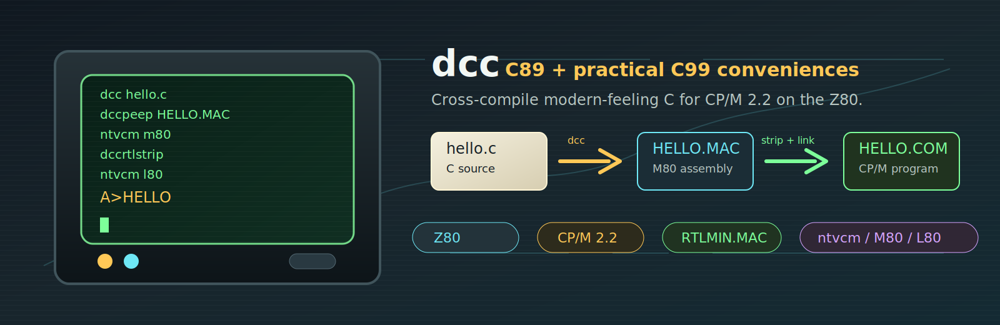

# Introduction

**dcc** is a C89 compiler that targets **CP/M 2.2 on the Z80**. It reads a `.c`
file and generates an M80-syntax `.MAC` assembly file that is assembled by M80
and linked by L80 to produce a CP/M `.COM` program.

dcc and the [ntvcm](https://github.com/davidly/ntvcm) emulator are
general-purpose tools: although the dcc repo bundles a test suite and build
scripts, you will normally use them to build your **own** CP/M / Z80 C apps in
independent projects. Once the tools are on your `PATH`, you can compile and run
from any directory — you don't need to work inside the dcc repo.

This documentation is a practical guide to the language dcc accepts and the C
runtime library it ships with. It is split into focused topics so you can jump
straight to the area you need:

- [Setting up the toolchain](00-setup-toolchain.md) — build dcc and ntvcm and
  put the tools on your `PATH` for macOS, Linux, and Windows.
- [Agent skills](00-agent-skills.md) — let an AI coding assistant write correct
  dcc/CP/M/Z80 code by loading the bundled skill.
- [C89 conformance and C99 extensions](01-c89-conformance.md) — which keywords
  and features are supported, and the handful of post-C89 conveniences.
- [Building and linking](02-build-and-link.md) — how a `.c` file becomes a
  `.COM` file and the options that matter most.
- [Types and conventions](03-types-and-conventions.md) — sizes of `int`,
  `long`, `float`, pointers, and the constants you can rely on.
- [Operators](04-operators.md) — the full operator set and the 16-bit gotchas.
- Library reference: [stdio](05-stdio.md), [stdlib](06-stdlib.md),
  [strings and ctype](07-strings-and-ctype.md), [math](08-math.md),
  [utility headers](09-utility-headers.md), and
  [system / CP/M services](10-system-and-cpm.md).
- [Limitations](11-limitations.md) and [worked examples](12-examples.md).
- An [appendix on `dccrtlstrip`](appendix/01-dccrtlstrip.md) explaining how the
  runtime is trimmed and what each library call costs in code size.

## How the runtime fits together

`DCCRTL.MAC` is the single source of truth for the runtime. It is written in Z80
assembly (M80/L80 syntax) for size and speed and provides:

- the `start` entrypoint that sets up the heap and parses the command line into
  `argc` / `argv` before calling your `main`,
- a near complete coverage of the C89 library (documented across these pages),
- 16-/32-bit integer and 32-bit float arithmetic helpers that the compiler
  calls implicitly.

For normal application builds, the runtime is trimmed before linking so unused
library code does not inflate the final `.COM` file. The build workflow covers
that step in [Building and linking](02-build-and-link.md), and the internals and
size trade-offs are kept in the [appendix](appendix/01-dccrtlstrip.md).

!!! note "Single source of truth"
    Functions that are declared in the standard headers but are **not** part of
    the linked runtime are called out explicitly in
    [Limitations](11-limitations.md) so a missing function never surprises you
    at link time.

## Compiler performance snapshot

The chart below compares `.COM` programs produced by dcc with other CP/M-era
and modern CP/M-targeting compilers. The timing column uses `ntvcm -p` cycle
counts converted to the emulator's `approx ms at 4Mhz` value for Z80-mode runs.
Sizes are CP/M file sizes rounded to the next 128-byte record. Lower numbers are
better for both `ms` and `bytes`.

The chart columns mean:

| Label | Meaning |
| --- | --- |
| `compiler` | Compiler, interpreter, or hand-written assembly implementation being compared. |
| `year` | Release year, or benchmark row year for dcc-built interpreters. |
| `ms` | `ntvcm -p` cycle-count timing converted to `approx ms at 4Mhz` for Z80-mode runs. |
| `bytes` | Final CP/M `.COM` file size, rounded by the filesystem to 128-byte records. |
| `runtime, size / notes` | Required runtime/interpreter size or special notes such as missing float support, benchmark hacks, or failures. |
| `cpu` | Instruction set targeted by the generated program: `8080` means 8080-compatible code; `Z80` means Z80-specific code. |

The benchmark groups are:

| Label | What it measures |
| --- | --- |
| `tstring` | String/memory runtime performance: `strlen`, `strchr`, `strrchr`, `strstr`, `memcmp`, `memcpy`, `memset`, `memchr`, plus `rand` and integer modulus. |
| `sieve` | BYTE magazine Sieve of Eratosthenes benchmark; mostly loop and array performance. |
| `e` | Computes digits of `e`; stresses integer division, modulus, loops, arrays, and formatted output. |
| `tm` | Allocator benchmark using `malloc`, `calloc`, `free`, and `memset`. |
| `ttt` | Tic-tac-toe search; stresses function calls, branching, loops, arrays, and small integer work. |
| `pihex` | Computes hexadecimal digits of pi; stresses unsigned long modular arithmetic and single-precision float math. |
| `mm` | 20x20 matrix multiply benchmark; stresses float initialization, addition, multiplication, and array indexing. |

Rows labelled `dcc C89 v1.0 win/linux/mac xcomp` show dcc cross-compiled output
without the peephole optimizer. Rows labelled `dcc C89 v1.0 dccpeep optimized`
show the same compiler output after the `dccpeep` optimizer pass.
