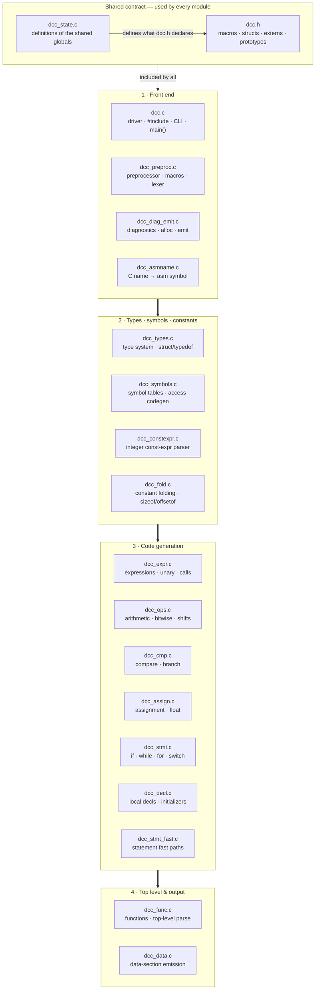
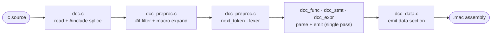

# dcc — modularised compiler source

`dcc` is a tiny bootstrap C89 compiler that targets Z80 assembly for the
Microsoft M80 / LINK-80 toolchain on CP/M-80. This directory holds the
**modularised** form of the compiler: the original ~18.8k-line single file was
split into focused, separately compiled modules — one `.c` per subsystem plus a
shared umbrella header — so that both human and agentic developers can navigate
and modify one subsystem at a time.

> The original monolith is preserved at [`../ddc.c`](../ddc.c) as a reference
> snapshot. The repository-root [`../../dcc.c`](../../dcc.c) is an older
> standalone copy and is **not** part of this build.

---

## How the modular build is structured

`dcc` is a **single-pass, syntax-directed** compiler: it has no AST. Parsing
and code generation are interleaved and share a large amount of file-scope
state. Because of that tight coupling, the modules are organised the way a
classic single-binary C compiler is: **one umbrella header that every module
includes**, rather than many small per-module headers.

- [`dcc.h`](dcc.h) is the umbrella header. It declares everything shared:
  capacity macros, the type/storage/token constants, the core record types
  (`Token`, `Sym`, `Def`, `AsmName`, `TypeDef`, `FieldDef`, `StructDef`,
  `ConstVal`, `ByteOperand`), `extern` declarations for the shared globals, and
  the prototypes for every cross-module function (grouped by owning module).
- Each subsystem is a normal `.c` translation unit that starts with
  `#include "dcc.h"`. They are compiled separately and linked together.
- [`dcc_state.c`](dcc_state.c) **defines** the shared globals once; every other
  module reaches them through the `extern` declarations in [`dcc.h`](dcc.h).
- [`dcc.c`](dcc.c) is the driver translation unit and contains `main()`.

This is the traditional `.c` / `.h` layout. The split itself was
behaviour-preserving: at the time of the split the modular compiler generated
**byte-for-byte identical** assembly to the monolith, verified by the project's
regression suite (see *Verifying* below).

> The modular tree has since gained **correctness fixes that the monolith
> snapshot does not have** (notably the float/`long` type-resolution work and
> the type oracle described below). Those changes intentionally diverge from
> [`../ddc.c`](../ddc.c); the regression baseline
> ([`../../baseline_test_dcc.txt`](../../baseline_test_dcc.txt)) now tracks the
> modular compiler itself, and the byte-identical guarantee is against that
> baseline, not against the monolith. The suite still compares program output,
> so a fix that only makes a previously-miscompiled program correct keeps every
> other app's output unchanged.

### Why there is one shared header instead of many

The parser and code generator genuinely share most of their data: the source
buffer, the lookahead token, the symbol/typedef/struct tables, and a set of
per-function codegen flags. Splitting those into per-module headers would just
produce a web of headers that all include each other. A single umbrella header
keeps the shared contract in one place and the modules free of cross-include
ordering puzzles.

### State ownership

Most mutable state is shared and therefore defined in [`dcc_state.c`](dcc_state.c)
and declared `extern` in [`dcc.h`](dcc.h). A small amount of state is private to
a single module and kept `static` there:

- `pp_expr_p` / `pp_expr_depth` → [`dcc_preproc.c`](dcc_preproc.c) (the `#if`
  expression cursor)
- `include_dirs` / `num_include_dirs` → [`dcc.c`](dcc.c) (the include search
  path)

### Type resolution without an AST: the type oracle

Because codegen is interleaved with parsing, the compiler often has to know an
operand's C type *before* it generates that operand — when it reaches a binary
operator, a `?:` arm, or a branch condition it must already have chosen 16-bit
vs 32-bit vs float code. With no AST there is nothing to consult, so the
historical approach was a **shallow source-text lookahead**
(`peek_simple_unary_type`, `snippet_simple_type`) that inspects only the first
token or two of the upcoming operand.

That shallow peek is the root of a recurring **type blind-spot bug class**: a
type hidden behind parentheses, a cast, a struct member, an array decay, or a
nested conditional is mis-predicted, and the wrong-width code is emitted (for
example a `float` operand dropped to 16 bits, or a `long` high word lost). The
branches around it then need post-generation fixups that trust the *actual*
result type (`g_expr_type`) once the operand has finally been emitted.

The **type oracle** in [`dcc_ops.c`](dcc_ops.c) replaces the shallow guess with
a complete answer. `typeof_conditional_arm()` and its internal `to_*` ladder
(`to_postfix` → `to_unary` → `to_mul`/`to_add`/`to_shift`/`to_rel`/`to_eq` →
the bitwise levels → `to_conditional` → `to_assign`/`to_comma`) walk the full
expression grammar and report the C type the code generator will ultimately
produce — applying the usual arithmetic conversions (`float` outranks `long`
outranks unsigned outranks `int`), pointer-arithmetic rules, and
array-to-pointer decay — but **emit no code**. It is a *type-only* mirror of the
`gen_*` precedence ladder.

Two properties make this safe and cheap:

- **Bounded blast radius.** The public entry snapshots *all* lexer/token state
  (`posi`, `tok_start_pos`, `line_no`, `tok_line`, the numeric-suffix flags, and
  the lookahead `tok`) and restores it before returning. The real codegen
  re-parses the same tokens afterwards, so a bug in the walker can only produce
  a **wrong type verdict** — it can never corrupt the token stream or desync the
  parser.
- **No second real pass.** This is a "1.5-pass" technique: it buys accurate
  whole-expression type information without a full AST/IR and without a second
  code-generating pass, preserving dcc's tiny single-pass character.

The oracle is currently adopted narrowly — `gen_conditional` uses it to decide
whether a `?:` is a `float` expression (so the already-generated arm can be
converted before the branches join). Other type-guess sites still use the
shallow peek plus the `g_expr_type` post-generation fallback; routing more of
them through the oracle is a deliberate, regression-gated follow-up rather than
a blanket change.

---

## Module architecture



*Reading the diagram:* the **Shared contract** (top) is `#include`d by every
module. The thick arrows are the dominant translation pipeline — front end →
types/symbols → code generation → top level & output. Within a stage the files
are peers; the per-file call relationships are summarised in the runtime flow
below.

### Compilation pipeline (runtime flow)



Calls flow roughly front-to-back, but because every module shares `dcc.h` any
module may call any other module's functions (the prototypes are all visible).
The arrows above show the dominant direction, not a hard layering restriction.

---

## The modules

| File | Responsibility |
| --- | --- |
| [`dcc.h`](dcc.h) | Umbrella header included by every module: capacity macros (`MAX_*`), type/storage/token constants (`TYPE_*`, `SC_*`, `TOK_*`), the nine core record types, `extern` declarations of the shared globals, and grouped prototypes for every cross-module function. |
| [`dcc_state.c`](dcc_state.c) | Definitions of the shared globals declared `extern` in `dcc.h`: source buffer + lexer position + lookahead token, symbol/typedef/struct/field tables, the macro table, the `#if` stack, the string pool, per-function codegen flags, and parser scratch state. |
| [`dcc_asmname.c`](dcc_asmname.c) | Maps each C identifier to its emitted M80 assembler symbol: when to mangle (M80's 6-significant-character publics, reserved words), recognises fixed runtime-library entry points, and caches results in `asm_names[]`. |
| [`dcc_diag_emit.c`](dcc_diag_emit.c) | Plumbing: `fatal`/`error_here` diagnostics, `source_location_at` (`#line`-aware), `xmalloc`/`xstrdup2`, label allocation, the `emit*` assembly-output primitives, and the raw source readers `peekc`/`getc_src`. |
| [`dcc_preproc.c`](dcc_preproc.c) | Preprocessor + lexer: `#define`/`#undef`/`#if`/`#ifdef`, object- and function-like macro expansion (`#` stringize, `##` paste), the `#if` constant-expression evaluator, and the main tokenizer `next_token`. |
| [`dcc_types.c`](dcc_types.c) | Type system: base-type and declarator parsing, struct/union and typedef tables, bitfield layout, type sizing/promotion/arithmetic helpers, and enum-constant lookup. |
| [`dcc_constexpr.c`](dcc_constexpr.c) | The `parse_const_long_*` precedence ladder that evaluates compile-time integer constant expressions for array bounds, enum values and case labels. |
| [`dcc_symbols.c`](dcc_symbols.c) | Symbol tables (locals, parameters, globals), the string-literal pool, EXTRN bookkeeping, and code that loads/stores a symbol's address or value, including post-increment/decrement fast paths. |
| [`dcc_fold.c`](dcc_fold.c) | The `cf_*` constant-folding engine (with C type/promotion rules), `sizeof`/`offsetof` evaluation, and emission of folded constant results. |
| [`dcc_expr.c`](dcc_expr.c) | Core expression code generation: `gen_primary`/`gen_unary`, casts, dereference/address-of, function-call argument marshalling (scalar/struct/variadic), and a large set of recognised fast-path peepholes. |
| [`dcc_cmp.c`](dcc_cmp.c) | Relational/equality comparison codegen (signed/unsigned, 16- and 32-bit) and condition-to-branch lowering, including single-`cp` byte-operand comparators. |
| [`dcc_ops.c`](dcc_ops.c) | Binary-operator/arithmetic codegen: `+ - * / %`, shifts, bitwise ops across 16/32-bit and unsigned variants, integer promotion, pointer element-size scaling, and power-of-two float scaling. Also hosts the **type oracle** (`typeof_conditional_arm` + the `to_*` ladder): a side-effect-free, type-only walk of the expression grammar used to resolve an operand's type without emitting code (see *Type resolution without an AST* above). |
| [`dcc_assign.c`](dcc_assign.c) | Assignment lowering (plain/compound; scalar/struct/bitfield/array element), float literal and r-value materialisation, and the top-level `gen_expr` entry points. |
| [`dcc_stmt_fast.c`](dcc_stmt_fast.c) | Whole-statement fast-path idioms: in-place `++`/`--`, self-add accumulation, and the CRC-update byte idiom. Each falls back to the generic path when unmatched. |
| [`dcc_decl.c`](dcc_decl.c) | Local declaration and initializer codegen: scalars, arrays, structs/unions, bitfields, brace initializer lists, and const-scalar folding of local initializers. |
| [`dcc_stmt.c`](dcc_stmt.c) | Statement dispatcher and lowering for compound blocks, `if`/`else`, `while`, `for`, `do`-`while`, `switch` (if-chain and jump-table strategies), `return`, `break`/`continue`, `goto`, and several pointer-walking loop idioms. |
| [`dcc_func.c`](dcc_func.c) | Function and top-level declaration parsing: prototype and K&R parameter lists, prologue/epilogue and frame layout, the function-body scan, typedef declarations, and file-scope object parsing/emission. |
| [`dcc_data.c`](dcc_data.c) | Data-section emission: the string-literal pool and global object storage with initializers, rendered as `DEFB`/`DEFW`. |
| [`dcc.c`](dcc.c) | Driver and entry point: input file I/O, `#include` resolution and line-directive splicing, the active-source filtering pass, command-line option parsing, and `main()`. |

---

## Building

From the repository root:

```sh
# Option A: the build script (writes ./dcc at the repo root)
sh src/dcc/build-dcc.sh

# Option B: CMake
cmake -S src/dcc -B build/dcc
cmake --build build/dcc      # also writes ./dcc at the repo root
```

Both compile every module (`dcc.c`, `dcc_state.c`, and the `dcc_*.c` files) with
`-std=c89 -Wall -Wextra -O2` and link them into `./dcc` at the repository root,
matching the conventions the `ma.sh` / `runall.sh` harness expects. The
companion tools `dccpeep` and `dccrtlstrip` are unchanged and are built by the
existing root scripts (`mmacos.sh` / `m.sh`).

Override the compiler or flags via environment variables:

```sh
CC=gcc CFLAGS="-std=c89 -O2" sh src/dcc/build-dcc.sh
```

> Note: linking may print `ld: warning: reducing alignment of section
> __DATA,__common ...`. That is benign — it reflects the compiler's large
> static tables and does not affect correctness.

---

## Verifying

The modular build must produce assembly identical to the monolith. To check a
single program:

```sh
./dcc -f sieve.c -o /tmp/sieve.mac
```

To run the full C89 regression suite (requires the `ntvcm` emulator on `PATH`):

```sh
export PATH="/path/to/ntvcm:$PWD:$PATH"
export DCC=./dcc DCCPEEP=./dccpeep DCCRTLSTRIP=./dccrtlstrip
sh ./runall.sh ntvcm
```

The suite writes `test_dcc.txt` (peephole-optimised) and `test_dccu.txt`
(unoptimised) and diffs them against `baseline_test_dcc.txt`. A non-zero exit
caused **only** by the `__DATE__` / `__TIME__` lines (the compile wall-clock
from the `tstdc` test) is expected and counts as green:

```sh
diff baseline_test_dcc.txt test_dcc.txt \
  | grep -vE '__DATE__|__TIME__|^[0-9]+(,[0-9]+)?c[0-9]+|^---$'
# empty output == GREEN
```

---

## Working in this codebase

- **Add or change behaviour** inside the relevant `dcc_*.c` module. Keep the
  change in the module that owns that responsibility.
- **Adding a new function that other modules call?** Define it in its module
  and add a prototype to the matching group in [`dcc.h`](dcc.h). Functions used
  only within one module can stay `static` and need no prototype in `dcc.h`.
- **Need a new shared constant or record type?** Add it to [`dcc.h`](dcc.h).
- **Need new shared state across modules?** Define it in [`dcc_state.c`](dcc_state.c)
  and add an `extern` declaration to [`dcc.h`](dcc.h). If it is used by only one
  module, prefer a `static` at the top of that module instead.
- **After any change**, rebuild and run the regression suite. For pure
  refactors, the filtered diff must stay empty.
- **Reaching for an operand's type before it is generated?** Prefer the type
  oracle (`typeof_conditional_arm` in [`dcc_ops.c`](dcc_ops.c)) over the shallow
  `peek_simple_unary_type` / `snippet_simple_type` lookahead. The shallow peeks
  only see the first token or two and are the source of the type blind-spot bug
  class (a float, `long`, or pointer hidden behind parens, a cast, a struct
  member, an array decay, or a nested `?:`). If you must use a peek, pair it
  with a post-generation check of the authoritative `g_expr_type`, and add a
  regression to [`../../tctxflt.c`](../../tctxflt.c) (the context/type-resolution
  test) for the shape you fixed.
